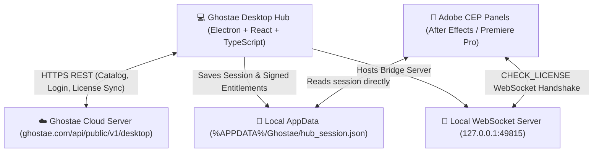

# 📋 Ghostae Desktop & Server Integration Audit Manifesto

> **Target Audience:** Server Engineering Team / Backend AI Auditor  
> **Application:** Ghostae Creative Suite Desktop Hub (v1.0.0)  
> **API Version:** `v1` (Public Desktop API)  
> **Protocol:** HTTPS (REST) + Local IPC + Local WebSocket (`ws://127.0.0.1:49815`)  
> **Audit Status:** Ready for Server Audit & Verification

---

## 1. 🏗️ Architecture & Component Topology



---

## 2. 🌐 Cloud REST API Specification (Desktop $\rightarrow$ Server)

**Base URL:** `https://ghostae.com/api/public/v1/desktop`  
*(Configurable via environment variable `VITE_GHOSTAE_API_BASE_URL`)*

---

### Endpoint 1: Fetch Live Catalog
* **Method:** `GET`
* **Route:** `/catalog`
* **Headers:**
  ```http
  Accept: application/json
  x-ghostae-hwid: <DETERMINISTIC_MACHINE_HWID>
  x-ghostae-platform: win32 | darwin
  ```
* **Expected Server Response (`200 OK`):**
  ```json
  {
    "status": "success",
    "products": [
      {
        "id": "prod-text",
        "slug": "text",
        "name": "Ghostae Text Panel",
        "category": "Typography",
        "latest_version": "3.40.0",
        "price_bdt": 2490,
        "is_free": false,
        "target_host": "BOTH",
        "min_ae_version": 2022,
        "thumbnail_url": "https://ghostae.com/assets/products/text.png",
        "download_url": "https://ghostae.com/api/downloads/ghostae-text-latest.zip",
        "cep_folder_name": "com.ghostae.text",
        "description": "Next-gen motion typography engine for After Effects & Premiere Pro.",
        "changelog": "v3.40.0 - Added auto-kerning and new kinetic presets.",
        "features": [
          { "title": "500+ Presets", "desc": "One-click dynamic animations" },
          { "title": "Dual Host", "desc": "Works seamlessly in AE and Premiere" }
        ],
        "screenshots": [
          { "url": "https://ghostae.com/assets/screenshots/text-1.png", "title": "Main Panel" },
          { "url": "https://ghostae.com/assets/screenshots/text-2.png", "title": "Preset Browser" },
          { "url": "https://ghostae.com/assets/screenshots/text-3.png", "title": "Inspector" }
        ],
        "tutorials": [
          {
            "id": "tut-1",
            "title": "Getting Started with Ghostae Text",
            "url": "https://www.youtube.com/watch?v=example",
            "thumbnail": "https://img.youtube.com/vi/example/maxresdefault.jpg",
            "duration": "10:24"
          }
        ]
      }
    ]
  }
  ```

---

### Endpoint 2: User Login with Email & Password
* **Method:** `POST`
* **Route:** `/auth/login`
* **Headers:** `Content-Type: application/json`
* **Request Body:**
  ```json
  {
    "email": "user@example.com",
    "password": "SecurePassword123",
    "machine_hwid": "16768741-3a0c-473a-8e87-d7bb7903bd80",
    "machine_name": "DESKTOP-STUDIO",
    "platform": "win32"
  }
  ```
* **Expected Server Response (`200 OK`):**
  ```json
  {
    "status": "success",
    "token": "ghst_jwt_session_token_xyz...",
    "user": {
      "id": "usr_98124",
      "email": "user@example.com",
      "name": "Ghostae Pro User",
      "isPro": true
    },
    "licenses": [
      {
        "id": "lic_01",
        "product_slug": "text",
        "product_name": "Ghostae Text Panel",
        "license_key": "GHST-TEXT-PRO-ACTIVATED",
        "status": "active",
        "validity": "Lifetime",
        "expires_at": null,
        "max_devices": 2,
        "is_active_on_this_machine": true,
        "is_enabled": true
      }
    ]
  }
  ```

---

### Endpoint 3: Instant License Key Login
* **Method:** `POST`
* **Route:** `/auth/license-login`
* **Headers:** `Content-Type: application/json`
* **Request Body:**
  ```json
  {
    "license_key": "GHST-XXXX-XXXX-XXXX",
    "machine_hwid": "16768741-3a0c-473a-8e87-d7bb7903bd80",
    "machine_name": "DESKTOP-STUDIO",
    "platform": "win32"
  }
  ```
* **Expected Server Response (`200 OK`):**
  ```json
  {
    "status": "success",
    "token": "ghst_jwt_session_token_xyz...",
    "user": {
      "id": "usr_license_holder",
      "email": "license-holder@ghostae.com",
      "name": "License Holder",
      "isPro": true
    },
    "licenses": [
      {
        "id": "lic_key_01",
        "product_slug": "text",
        "product_name": "Ghostae Text Panel",
        "license_key": "GHST-XXXX-XXXX-XXXX",
        "status": "active",
        "validity": "Lifetime",
        "expires_at": null,
        "max_devices": 2,
        "is_active_on_this_machine": true,
        "is_enabled": true
      }
    ]
  }
  ```

---

### Endpoint 4: Sync User Licenses & Device Activations
* **Method:** `POST`
* **Route:** `/licenses/sync`
* **Headers:**
  ```http
  Content-Type: application/json
  Authorization: Bearer <TOKEN>
  x-ghostae-hwid: <DETERMINISTIC_MACHINE_HWID>
  ```
* **Request Body:**
  ```json
  {
    "machine_hwid": "16768741-3a0c-473a-8e87-d7bb7903bd80"
  }
  ```
* **Expected Server Response (`200 OK`):**
  ```json
  {
    "status": "success",
    "licenses": [
      {
        "id": "lic_01",
        "product_slug": "text",
        "product_name": "Ghostae Text Panel",
        "license_key": "GHST-TEXT-PRO-ACTIVATED",
        "status": "active",
        "validity": "Lifetime",
        "expires_at": null,
        "max_devices": 2,
        "is_active_on_this_machine": true,
        "is_enabled": true
      }
    ]
  }
  ```

---

### Endpoint 5: Device HWID Activation / Deactivation
* **Activate Route:** `POST /licenses/activate-hwid`
* **Deactivate Route:** `POST /licenses/deactivate-hwid`
* **Headers:** `Authorization: Bearer <TOKEN>`
* **Request Body:**
  ```json
  {
    "license_key": "GHST-TEXT-PRO-ACTIVATED",
    "machine_hwid": "16768741-3a0c-473a-8e87-d7bb7903bd80",
    "machine_name": "DESKTOP-STUDIO"
  }
  ```
* **Expected Server Response (`200 OK`):**
  ```json
  {
    "status": "success",
    "message": "Device activated successfully.",
    "devices_used": 1,
    "max_devices": 2
  }
  ```

---

## 3. 🔐 Local File Session (`hub_session.json`) Specification

When the user logs in or syncs licenses, Desktop Hub writes the session file to:
* **Windows:** `%APPDATA%\Ghostae\hub_session.json` (`C:\Users\<User>\AppData\Roaming\Ghostae\hub_session.json`)
* **macOS:** `~/Library/Application Support/Ghostae/hub_session.json`

### File Schema:
```json
{
  "user_email": "user@example.com",
  "licenses": {
    "text": {
      "valid": true,
      "status": "active",
      "plan": "pro",
      "key": "GHST-TEXT-PRO-ACTIVATED"
    },
    "ghostae-text": {
      "valid": true,
      "status": "active",
      "plan": "pro",
      "key": "GHST-TEXT-PRO-ACTIVATED"
    }
  },
  "machine_id": "16768741-3a0c-473a-8e87-d7bb7903bd80",
  "last_synced": "2026-10-02T21:52:42.164Z",
  "offline_until": "2026-11-01T21:52:42.164Z",
  "entitlements": {
    "text": {
      "product_slug": "text",
      "status": "active",
      "plan": "pro",
      "machine_id": "16768741-3a0c-473a-8e87-d7bb7903bd80",
      "issued_at": "2026-10-02T21:52:42.164Z",
      "offline_until": "2026-11-01T21:52:42.164Z",
      "signature": "a4a34462070c5ca8b83f9bbf190dc2eafd1139c2d0edf3f48aabb987fb69581a"
    }
  }
}
```

---

## 4. 🔌 Local WebSocket Server (`ws://127.0.0.1:49815`) Specification

Ghostae Desktop runs a secure local bridge listening strictly on `127.0.0.1:49815`.

* **Incoming message from CEP Extension:**
  * Raw string: `CHECK_LICENSE`
  * Or JSON:
    ```json
    {
      "action": "CHECK_LICENSE",
      "product": "text"
    }
    ```
* **Outgoing response from Desktop Hub:**
  ```json
  {
    "valid": true,
    "plan": "pro",
    "status": "active",
    "product": "text",
    "checkedVia": "hub_socket",
    "offlineUntil": "2026-11-01T21:52:42.164Z"
  }
  ```

---

## 5. 🛡️ Offline Resilience & Grace Period
* **Duration:** 30 Days Offline Grace.
* **Mechanism:** If the server is unreachable or offline, Desktop Hub validates local signed entitlements using `HMAC-SHA256` matching the deterministic Machine HWID. Extensions continue working seamlessly offline without disruption.
